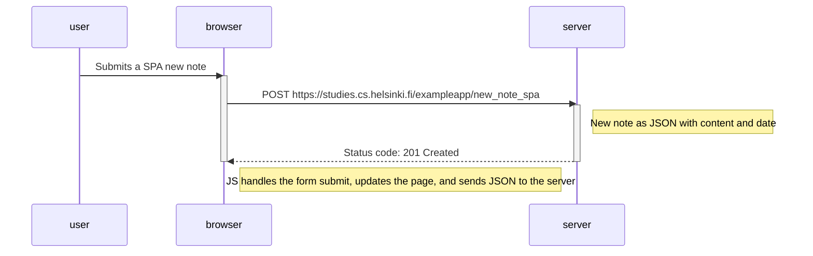

```mermaid
sequenceDiagram
    participant user
    participant browser
    participant server


    user->>browser: Submits a SPA new note
        activate browser
    browser->>server: POST https://studies.cs.helsinki.fi/exampleapp/new_note_spa
    activate server

    Note right of server: New note as JSON with content and date

    server-->>browser: Status code: 201 Created
    deactivate server
    deactivate browser

    Note right of browser: JS handles the form submit, updates the page, and sends JSON to the server
```
