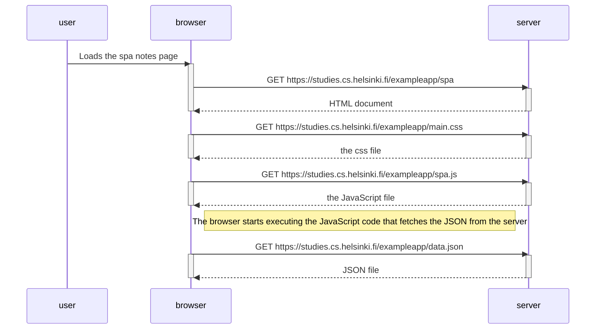

```mermaid
sequenceDiagram
    participant user
    participant browser
    participant server


    user->>browser: Loads the spa notes page
    activate browser
    browser->>server: GET https://studies.cs.helsinki.fi/exampleapp/spa
    activate server
    server-->>browser: HTML document
    deactivate server
    deactivate browser

    browser->>server: GET https://studies.cs.helsinki.fi/exampleapp/main.css
    activate browser
    activate server
    server-->>browser: the css file
    deactivate server
    deactivate browser

    browser->>server: GET https://studies.cs.helsinki.fi/exampleapp/spa.js
    activate browser
    activate server
    server-->>browser: the JavaScript file
    deactivate server
    deactivate browser

    Note right of browser: The browser starts executing the JavaScript code that fetches the JSON from the server

    browser->>server: GET https://studies.cs.helsinki.fi/exampleapp/data.json
    activate browser
    activate server
    server-->>browser: JSON file
    deactivate server
    deactivate browser
```
